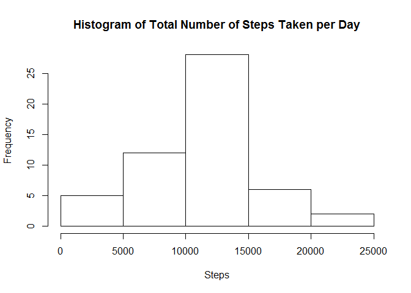
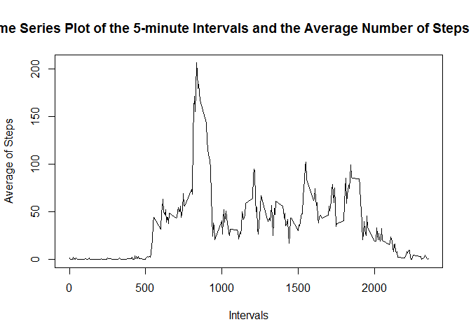
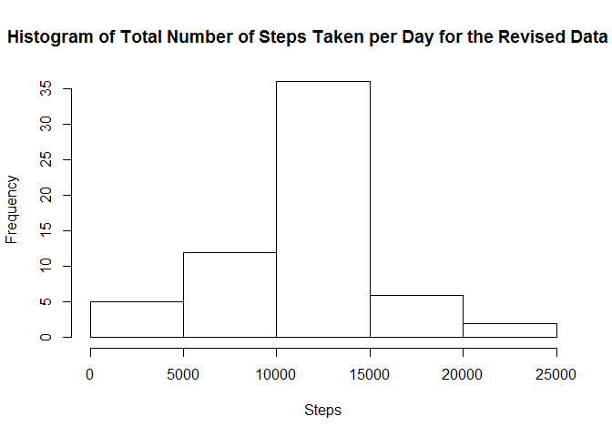
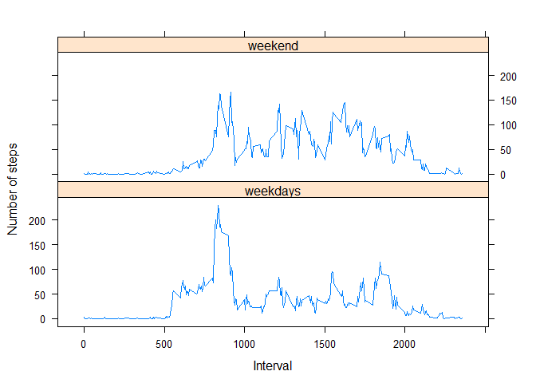

# Loading and preprocessing the data

1. Load the data


```r
if(!file.exists("./data")){dir.create("./data")}
fileUrl<-"https://d396qusza40orc.cloudfront.net/repdata%2Fdata%2Factivity.zip"
download.file(fileUrl,destfile="./data/Dataset.zip")        
unzip(zipfile = "./data/Dataset.zip",exdir = "./data")
```
2. Read the data


```r
dt<-read.csv("./data/activity.csv",sep=',')
```

3. Process/transform the data


```r
dt$date<-as.Date(as.character(dt$date),format="%Y-%m-%d")
dt2 <- subset(dt,!is.na(dt[,1]))
```


# What is mean total number of steps taken per day?

1. Calculate the total number of steps taken per day


```r
dt_daily_sum <- dt2 %>% group_by(date) %>% summarise_all(funs(sum))
```

2. Make a histogram of the total number of steps taken each day


```r
hist(dt_daily_sum$steps,xlab="Steps",main="Histogram of Total Number of Steps Taken per Day")
```

<!-- -->

3. Calculate and report the mean and median of the total number of steps taken per day


```r
dt_daily_mean <- mean(dt_daily_sum$steps)
dt_daily_median <- median(dt_daily_sum$steps)
```
# What is the average daily activity pattern?

1.Make a time series plot of the 5-minute interval (x-axis) and the average number of steps taken, averaged across all 

```r
dt_daily_avg <- dt2 %>% group_by(interval) %>% summarise_all(funs(mean))
plot(dt_daily_avg$interval,dt_daily_avg$steps,type = "l",xlab="Intervals",ylab = "Average of Steps",main = "Time Series Plot of the 5-minute Intervals and the Average Number of Steps Taken")
```

<!-- -->

2. Which 5-minute interval, on average across all the days in the dataset, contains the maximum number of steps?


```r
dt_daily_avg_max_step <- max(dt_daily_avg$steps)
dt_daily_avg_max_int <- dt_daily_avg$interval[dt_daily_avg$steps==dt_daily_avg_max_step]
```

# Imputing missing values
1. Calculate and report the total number of missing values in the dataset


```r
dt_missing <- sum(is.na(dt$steps))
```

2. Devise a strategy for filling in all of the missing values in the dataset


```r
dt3_missing <- subset(dt,is.na(dt$steps))
dt3_missing[, 1] <- dt_daily_avg$steps
```

3.  Create a new dataset that is equal to the original dataset but with the


```r
dt_full <- rbind(dt[complete.cases(dt), ], dt3_missing)
```


4. Make a histogram of the total number of steps taken each day and 


```r
dt_full_daily_sum <- dt_full %>% group_by(date) %>% summarise_all(funs(sum))
hist(dt_full_daily_sum$steps,xlab="Steps",main="Histogram of Total Number of Steps Taken per Day for the Revised Data set")
```

<!-- -->

5. Calculate and report the mean and median total number of steps taken per day. 


```r
dt_daily_mean <- mean(dt_full_daily_sum$steps)
dt_daily_median <- median(dt_full_daily_sum$steps)
```


# Are there differences in activity patterns between weekdays and weekends?
1. Create a new factor variable in the dataset with two levels - "weekday" and "weekend" indicating whether a given date is a weekday or weekend day.


```r
dt_full$weekdays <- weekdays(dt_full$date)
dt_full$weekdays[(dt_full$weekdays == "Saturday" | dt_full$weekdays == "Sunday")] <- "weekend"
dt_full$weekdays[(dt_full$weekdays != "Saturday" & dt_full$weekdays != "Sunday" & dt_full$weekdays != "weekend")] <- "weekdays"

dt_full_week <- aggregate(dt_full$steps, by = list(dt_full$interval,dt_full$weekdays), mean)

names(dt_full_week) <- c("interval", "weekdays", "steps")
```

2. Make a panel plot containing a time series plot (i.e. ) of the 5-minute interval (x-axis) and the average number of steps taken, averaged across all weekday days or weekend days (y-axis). See the README file in the GitHub repository to see an example of what this plot should look like using simulated data.


```r
library(lattice)
library(lattice)
xyplot(steps ~ interval | weekdays, data = dt_full_week, type = "l", xlab = "Interval",ylab = "Number of steps", layout = c(1, 2))
```

<!-- -->
